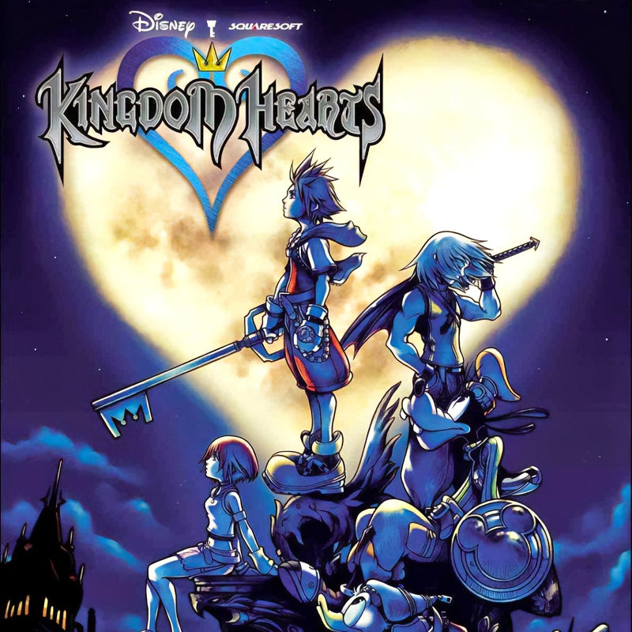

# Mission-5-Build-a-Game-Collection-Dashboard

# 🗝️ Memories of Light - Kingdom Hearts Collection

A responsive React web application that showcases a collection of Kingdom Hearts games. Users can view game details such as release year, target console, and ratings, as well as filter games dynamically by platform.

---

## Preview

 

---

## Features

- **Dynamic Filtering:** Filter the collection by gaming console/platform using an automatically populated dropdown.
- **Live Counter:** Real-time count of total games currently displayed based on active filters.
- **Component-Based Architecture:** Modular structure dividing the app into reusable components (Game card, GameCollection grid, and main App layout).
- **Responsive Layout:** CSS grid layout designed for seamless viewing across screen sizes.

---

## Tech Stack

- **Frontend:** React.js (Functional Components, Hooks)
- **State Management:** `useState` for tracking filter states
- **Styling:** CSS (Flexbox & CSS Grid)
- **Build Tool:** Vite / Create React App

---

## Build with

- HTML
- CSS
- JavaScript
- React
- Vite
- Git and GitHub

## Run the Project Locally

```bash
npm install
npm run dev
```
